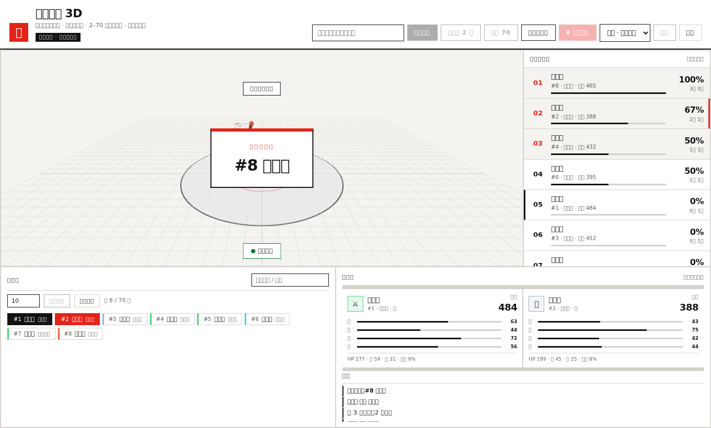
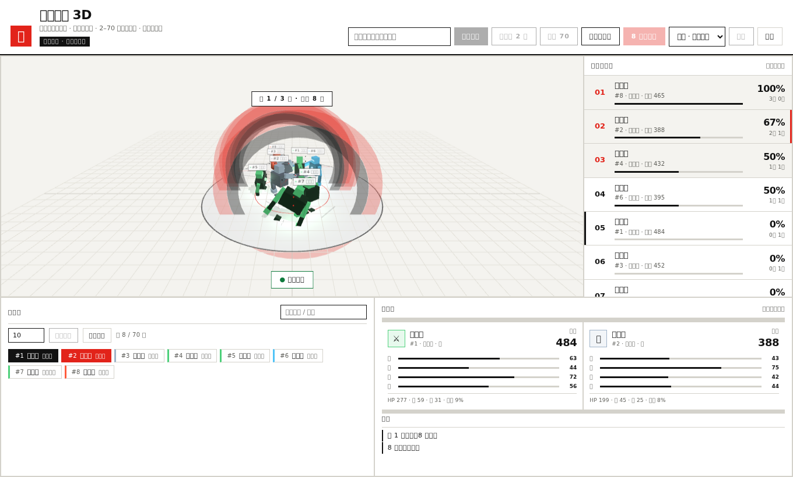

# 抽号斗士 3D · Seed Brawlers 3D

**抽号 → 生成 3D 小人 → 同台大乱斗 → 右侧胜率排行榜。**

号码就是种子：输入同一个号码，永远得到完全相同的小人（外观、属性、姓名全部一致）。
把一份**自定义名单**（如班级名单、公司花名册、摇号名单）粘贴进来，每一行按顺序拿到一个号码；
随后任意人数（2~70）可以**同台对撞**，逐轮两两淘汰，直到决出唯一冠军。右侧面板实时按**胜率**排出最强者。

> 一个完整可跑的系统：确定性随机 → 小人属性生成 → 对撞战斗模拟 → 多人淘汰赛 → 3D 可视化 → 战绩持久化 → 胜率排行榜。

界面采用**瑞士国际主义平面风格**：浅色纸感底、白面板、黑色字、单一红色强调，无渐变无霓虹。

**🌐 在线体验（GitHub Pages）：<https://dariondong.github.io/seed-brawlers-3d/>**



对撞瞬间（白闪 + 冲击环 + 速度线 + 碎块 + 镜头抖动，可用「暂停」定格）：



---

## 功能一览

| 模块 | 说明 |
| --- | --- |
| 抽号生成 | 输入号码（或自动取下一个），用号码作为随机种子确定性地生成小人 |
| 确定性小人 | 派系 × 五行元素 × 四项属性 × 体型参数，全部由号码唯一决定 |
| 自定义名单 | 粘贴姓名列表（换行 / 逗号 / 顿号分隔），第几行就是第几号；可用真名覆盖随机姓名 |
| 同台大乱斗 | 2~70 人同场，逐轮两两淘汰，直到唯一冠军；人数可选，支持**任意人数** |
| 单挑对撞 | 先蓄力冲锋，再逐拍交手；含命中/闪避/暴击/反击/击退，可选单局 / 三局两胜 / 五局三胜 / 七局四胜 |
| 冲击特效 | 白闪 + 双层冲击环 + 放射速度线 + 墨色碎块 + 镜头抖动，命中瞬间可暂停定格 |
| 回放控制 | 播放速度（0.5× / 1× / 2× / 4×）与暂停/继续，随时定格观赏对撞瞬间 |
| 胜率排行榜 | 右侧实时显示，按 **胜率 → 胜场 → 战力** 排序，前三名红色高亮 |
| 3D 竞技场 | Three.js 实时渲染，方块风格小人，可拖拽旋转 / 缩放视角 |
| 持久化 | 两种运行模式各自持久化，刷新 / 重启不丢失 |
| 双模式 + 零构建 | 同一套前端，既能连 Node 后端，也能纯静态跑；原生 ES Module，无需打包工具 |

---

## 🚀 两种运行方式（同一套前端，自动切换）

前端启动时会探测 `/api/health`：

- **探测到后端** → 走 HTTP，数据存服务端 `data/state.json`（功能最全，多人共享同一份数据）。
- **探测不到后端**（如 GitHub Pages / 直接打开文件）→ **自动切换为浏览器内置后端**：同一套 `engine/` 在浏览器里运行，数据存 `localStorage`。
  此模式下页面标题下会显示徽标 **「静态模式 · 数据存本地」**。

> 因此本仓库既可以直接 `npm start` 当完整服务跑，也可以部署到任意静态托管（GitHub Pages / Netlify / Vercel 静态…）。

### 方式 A：本地完整服务（Node）

```bash
# 需要 Node.js >= 20
npm install
npm start
```

打开 <http://localhost:3000>

```bash
npm run dev    # 开发模式（文件变更自动重启）
npm test       # 运行全部测试（34 个用例）
```

### 方式 B：纯静态预览（模拟 GitHub Pages）

```bash
npm run pages   # 同步引擎 + 启动零依赖静态服务器
```

打开 <http://localhost:4173>（等同于把 `public/` 作为站点根，等价于 Pages 环境）。

### 方式 C：GitHub Pages 在线部署

本仓库自带工作流 [`.github/workflows/pages.yml`](.github/workflows/pages.yml)：

1. push 到 `main` 后自动触发（也可在 Actions 页面手动 `workflow_dispatch`）。
2. 流程：`checkout → npm ci → 同步 engine 到 public/engine → npm test → 上传 public/ → deploy-pages`。
3. 部署完成后访问：<https://dariondong.github.io/seed-brawlers-3d/>

**首次使用需一次性开启 Pages（约 10 秒）：**

> 打开仓库 **Settings → Pages → Build and deployment → Source 选择 “GitHub Actions”**，保存即可。
> 之后每次 push 到 `main` 都会自动重新部署。
> （受权限限制，工作流无法自行创建 Pages 站点；这一步需要在网页端点一次。若你使用带 `pages:write` 权限的 PAT，工作流的 `enablement: true` 也能自动完成。）

> 💡 GitHub Free 计划下 Pages 仅支持**公开仓库**；本仓库已设为公开。

---

## 🕹️ 使用说明

### 方式一：手动抽号

1. **抽号**：在输入框填入号码（如 `7`）点「抽号生成」；留空则自动取下一个号码。
   点「自动抽 2 号」可快速随机补两名，点「抽满 70」一键补满到 70 人。
2. **选人**：在「抽号池」点击号码切换单挑双方；同一点击会在 A / B 两个槽位间轮换。
3. **单挑**：选择赛制（单局 / 三局两胜 / 五局三胜 / 七局四胜），点「单挑」。
4. 点「大乱斗」：全部上场小人同台逐轮淘汰，直到唯一冠军。
5. **看回放**：底部可调「速度」（0.5× / 1× / 1.5× / 2×）与「暂停 / 继续」，命中瞬间可暂停定格，观察冲击特效。

### 方式二：自定义名单（摇号名单）

1. 点顶部「自定义名单」打开弹窗。
2. 粘贴名单，每行一个名字（也支持逗号 / 顿号分隔）。
   名单里**第几行就是第几号**，号码决定属性与外观，姓名则显示为该行文字。
   点「填入示例名单」可一键载入 20 人示例。
3. 选择「本场上场人数」（最多 70 人）。
4. 选择写入方式：
   - **追加到现有名单**：新名字排在现有号码之后，保留已有战绩。
   - **清空并替换**：从 1 号开始，**战绩清零**，全新开打。
5. 点「N 人大乱斗」开始摇号淘汰赛。

> 想快速看效果：点顶部「名单演示」，自动载入 20 人示例名单（清空替换）并立即开一场大乱斗。

> 🔒 **确定性**：号码 `42` 在任何时间、任何机器上都生成同一个小人（姓名可被名单覆盖）。想「复现」某个对手，直接输入它的号码即可。

---

## 📐 号码如何变成小人

```
号码 N
  └─ FNV-1a 哈希 → mulberry32 伪随机流（种子固定）
       ├─ 派系（狂战士 / 剑术家 / 重装 / 拳宗 / 影刺 / 搏克手）
       ├─ 五行元素 → 配色（火冰雷暗钢毒）
       ├─ 四维属性：力 power / 速 speed / 韧 toughness / 技 technique
       ├─ 派生数值：HP、攻击、防御、暴击率、暴击倍率
       └─ 体型参数：身高、体宽、肩宽、臂长、腿长、头围
```

属性乘以**战力**综合评分后展示；对撞时还会考虑速度差带来的额外动量。

---

## 🗂️ 项目结构

```
engine/            ★ 共享引擎（纯 JS，无 Node 依赖，浏览器 / 服务端通用）
  rng.js           确定性随机（FNV-1a + mulberry32）
  fighters.js      号码 → 小人 生成（支持姓名覆盖）+ 排行排序
  battle.js        对撞战斗模拟（单局 / 系列赛）
  royale.js        多人同台逐轮淘汰赛（2~70 人）
  state.js         状态与业务操作（抽号 / 对撞 / 大乱斗 / 名单 / 排行）
server/
  store.js         Node 持久化外壳（把 engine 状态读写到 data/state.json）
  index.js         Express API + 静态资源服务
public/            ← 静态站点根（GitHub Pages 直接部署这个目录）
  index.html       页面结构
  styles.css       UI 样式
  main.js          UI 逻辑（抽号 / 名单 / 单挑 / 大乱斗 / 榜单）
  scene.js         3D 竞技场、镜头、单挑与多人淘汰赛动画
  humanoid.js      用基础几何体搭建方块风格 3D 小人
  api.js           前端 API 封装（自动选择远端 / 本地后端）
  backend.js       ★ 浏览器内置后端（静态模式下运行 engine + localStorage）
  engine/          ★ engine/ 的同步拷贝（浏览器只能 import 站点内文件）
  vendor/          本地 Three.js（离线可用）
scripts/
  sync-engine.mjs  把 engine/ 同步到 public/engine/，`--check` 校验一致性
  static-server.mjs 零依赖静态预览服务器（模拟 Pages）
tests/             node:test 测试（生成 / 战斗 / 大乱斗 / 存储 / API / 静态模式）
data/              运行时生成的 state.json（已 gitignore）
```

> `engine/` 是**唯一事实来源**；`public/engine/` 是给浏览器用的拷贝，由 `npm run sync:engine` 生成，并有测试保证二者始终一致。

---

## 🔌 API

本表对应「方式 A：Node 服务」；静态模式下 `public/api.js` 会自动把这些调用路由到浏览器内置后端，**调用签名完全一致**。

| 方法 | 路径 | 说明 |
| --- | --- | --- |
| `GET` | `/api/state` | 全部小人、排行榜、最近战报 |
| `POST` | `/api/draw` | 抽号生成，body `{ "number": 7 }`，留空取下一个 |
| `POST` | `/api/draw/batch` | 批量抽号，body `{ "count": 2 }` |
| `POST` | `/api/battle` | 单挑，body `{ "a": 1, "b": 2, "bestOf": 5 }`（a/b 可省略自动配对） |
| `POST` | `/api/royale` | 同台大乱斗，body `{ "size": 70 }`，逐轮淘汰至唯一冠军 |
| `POST` | `/api/roster` | 自定义名单，body `{ "text": "赵子龙\n关云长", "mode": "replace" }`（也支持 `{ "names": [...] }`；mode 为 `append` / `replace`） |
| `GET` | `/api/leaderboard` | 只取排行榜 |
| `POST` | `/api/reset` | 清空全部数据 |

示例：

```bash
curl -X POST localhost:3000/api/draw -H 'Content-Type: application/json' -d '{"number":42}'
curl -X POST localhost:3000/api/battle -H 'Content-Type: application/json' -d '{"a":1,"b":2,"bestOf":5}'
curl -X POST localhost:3000/api/royale -H 'Content-Type: application/json' -d '{"size":70}'
curl -X POST localhost:3000/api/roster -H 'Content-Type: application/json' -d '{"text":"赵子龙,关云长,张翼德","mode":"replace"}'
```

---

## ⚙️ 可调参数

- 属性区间：`engine/fighters.js` 的 `statScore()`
- 战斗节奏：`engine/battle.js` 的 `MAX_ROUNDS`、命中/暴击/反击公式
- 大乱斗上限：`engine/royale.js`、`engine/state.js` 与 `public/main.js` 的 `MAX_ROSTER`
- 人数越多动画越快：`public/scene.js` 的 `playRoyale()` 内 `speed`
- 派系与元素：`engine/fighters.js` 顶部的 `ARCHETYPES` / `ELEMENTS`
- 端口：环境变量 `PORT`（默认 `3000`；静态预览默认 `4173`）

---

## 📄 License

MIT
